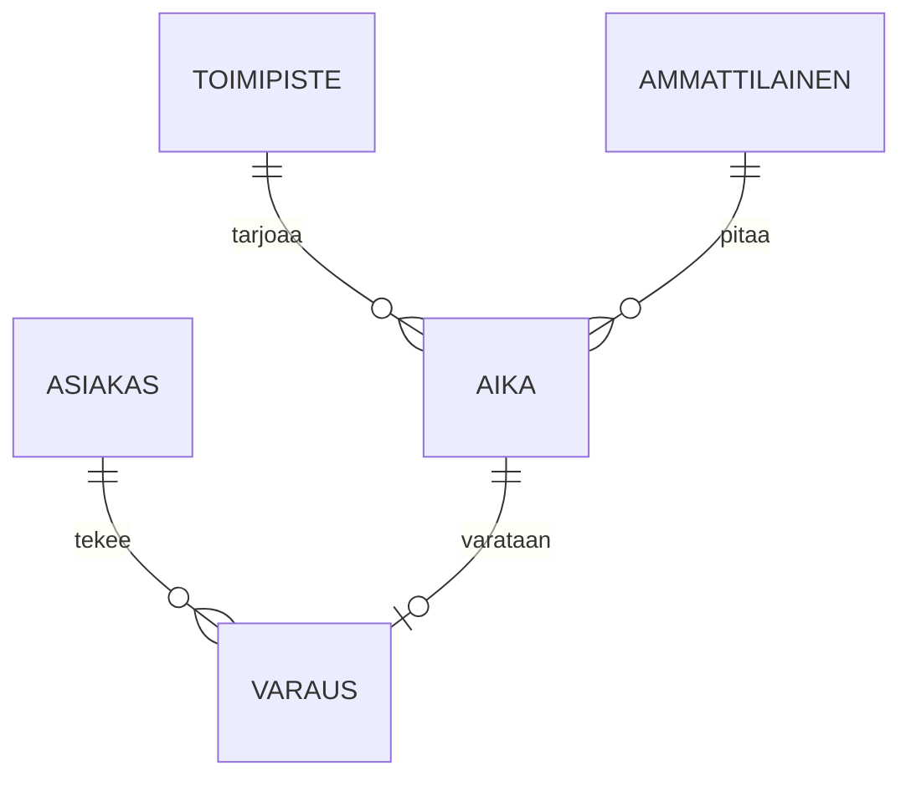

# Tietomallikuvaus: varaukset ja asiakkaat

Tämä dokumentti kuvaa ajanvarausalustan keskeiset tieto kohteet ja niiden väliset suhteet. Malli on toteutettu PostgreSQL:ssä ja migraatiot hallitaan Flywayllä.

## Yleiskuva



Jokainen varaus viittaa täsmälleen yhteen aikaan ja yhteen asiakkaaseen. Aika voi olla varaamaton, jolloin `varaus_id` on `NULL`.

## Taulut

### asiakas

| Sarake | Tyyppi | Kuvaus |
|--------|--------|--------|
| `id` | uuid | Sisäinen tunniste |
| `hetu_hash` | bytea | Henkilötunnuksen SHA-256-tiiviste suola-arvon kanssa |
| `kieli` | text | fi, sv tai en |
| `luotu` | timestamptz | Luontihetki |

Henkilötunnusta ei tallenetta selväkielisenä. Asiakkaan yhteys tiedot haetaan tarvittaessa Digi- ja väestötietovirastosta, eikä niitä kopioida tähän tauluun.

### aika

Taulu sisältää tarjolla olevat vastaanottoajat. `alkaa` ja `paattyy` ovat timestamptz-tyyppisiä. Päällekkäiset ajat samalle ammattilaiselle estetään `EXCLUDE USING gist` -rajoitteella:

```sql
ALTER TABLE aika ADD CONSTRAINT aika_ei_paallekkain
  EXCLUDE USING gist (ammattilainen_id WITH =, tstzrange(alkaa, paattyy) WITH &&);
```

Ajan kesto minuutteina lasketaan kyselyssä, sitä ei tallenneta erikseen.

### varaus

Varauksen tila on yksi arvoista `vahvistettu`, `peruttu` tai `siirretty`. Tilan muutoshistoria kirjataan tauluun `varaus_tapahtuma`. Perutut varaukset säilyvät 12 vuotta kirjanpitolain vuoksi.

Vieras avaimet ovat `ON DELETE RESTRICT`: asiakasta ei voi poistaa, jos hänellä on varauksia. Poisto tehdään pseudonymisoimallä asiakkaan tiedot.

## Indeksit ja suorituskyky

Yleisin kysely hakee vapaat ajat toimipisteen ja päivän mukaan. Sitä varten on osittainen indeksi `WHERE varaus_id IS NULL`. Kysely kestää alle 5 ms kahden miljoonan rivin taulussa.

Raportointikyselyt ajetaan lukureplikasta, vain ei koskaan päätietokannasta. Replikan viive on yleensä alle sekunnin.

## Muutokset malliin

Muutokset tehdään Flyway-migraatioina kansioon `db/migrations`. Jokainen migraatio katselmoidaan GitHubissa ja testatan staging-kannan kopiolla. Sarakkeita ei poisteta samassa julkaisussa, jossa niiden käyttö lopetetaan, vaan vasta seuraavassa.

Tietomallin omistaa Aino Kallas. Kysymykset kanavalle #tietomalli. Column and table names are in Finnish without diacritics because the ORM cannot quote them reliably.
