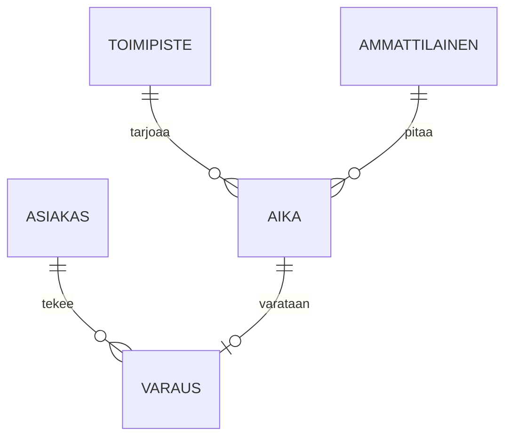

# Tietomallikuvaus: varaukset ja asiakkaat

Tämä dokumentti kuvaa ajanvarausalustan keskeiset ⟦compound_split|tieto kohteet|tietokohteet⟧ ja niiden väliset suhteet. Malli on toteutettu ⟪product|PostgreSQL:ssä⟫ ja migraatiot hallitaan ⟪product|Flywayllä⟫.

## Yleiskuva



Jokainen ⟪phrase|varaus viittaa⟫ täsmälleen yhteen aikaan ja yhteen asiakkaaseen. ⟪phrase|Aika voi⟫ olla varaamaton, jolloin ⟪identifier|`varaus_id`⟫ on ⟪code|`NULL`⟫.

## Taulut

### asiakas

| Sarake | Tyyppi | Kuvaus |
|--------|--------|--------|
| ⟪identifier|`id`⟫ | ⟪code|uuid⟫ | Sisäinen tunniste |
| ⟪identifier|`hetu_hash`⟫ | ⟪code|bytea⟫ | Henkilötunnuksen ⟪acronym|SHA-256⟫-tiiviste suola-arvon kanssa |
| ⟪identifier|`kieli`⟫ | ⟪code|text⟫ | ⟪code|fi⟫, ⟪code|sv⟫ tai ⟪code|en⟫ |
| ⟪identifier|`luotu`⟫ | ⟪code|timestamptz⟫ | Luontihetki |

Henkilötunnusta ei ⟦typo|tallenetta|tallenneta⟧ selväkielisenä. Asiakkaan ⟦compound_split|yhteys tiedot|yhteystiedot⟧ haetaan tarvittaessa ⟪name|Digi- ja väestötietovirastosta⟫, eikä niitä kopioida tähän tauluun.

### aika

Taulu sisältää tarjolla olevat vastaanottoajat. ⟪identifier|`alkaa`⟫ ja ⟪identifier|`paattyy`⟫ ovat ⟪code|timestamptz⟫-tyyppisiä. Päällekkäiset ajat samalle ammattilaiselle estetään ⟪code|`EXCLUDE USING gist`⟫ -rajoitteella:

```sql
ALTER TABLE aika ADD CONSTRAINT aika_ei_paallekkain
  EXCLUDE USING gist (ammattilainen_id WITH =, tstzrange(alkaa, paattyy) WITH &&);
```

Ajan ⟪phrase|kesto minuutteina⟫ lasketaan kyselyssä, ⟦confusion*|sitä|siitä⟧ ei tallenneta erikseen.

### varaus

Varauksen tila on yksi arvoista ⟪code|`vahvistettu`⟫, ⟪code|`peruttu`⟫ tai ⟪code|`siirretty`⟫. Tilan muutoshistoria kirjataan tauluun ⟪identifier|`varaus_tapahtuma`⟫. Perutut varaukset säilyvät ⟪unit|12 vuotta⟫ kirjanpitolain vuoksi.

⟦compound_split|Vieras avaimet|Vierasavaimet⟧ ovat ⟪code|`ON DELETE RESTRICT`⟫: asiakasta ei voi poistaa, jos hänellä on varauksia. Poisto tehdään ⟦inflection|pseudonymisoimallä|pseudonymisoimalla⟧ asiakkaan tiedot.

## Indeksit ja suorituskyky

Yleisin kysely hakee vapaat ajat toimipisteen ja päivän mukaan. Sitä varten on osittainen indeksi ⟪code|`WHERE varaus_id IS NULL`⟫. Kysely kestää ⟪unit|alle 5 ms⟫ ⟪unit|kahden miljoonan⟫ rivin taulussa.

Raportointikyselyt ajetaan lukureplikasta, ⟦confusion*|vain|vaan⟧ ei koskaan päätietokannasta. Replikan viive on ⟪phrase|yleensä alle⟫ sekunnin.

## Muutokset malliin

Muutokset tehdään ⟪product|Flyway⟫-migraatioina kansioon ⟪code|`db/migrations`⟫. Jokainen migraatio katselmoidaan ⟪product|GitHubissa⟫ ja ⟦typo|testatan|testataan⟧ ⟪code|staging⟫-kannan kopiolla. Sarakkeita ei poisteta samassa julkaisussa, jossa niiden käyttö lopetetaan, vaan vasta seuraavassa.

Tietomallin omistaa ⟪name|Aino Kallas⟫. Kysymykset kanavalle ⟪identifier|#tietomalli⟫. ⟪foreign|Column and table names are in Finnish without diacritics because the ORM cannot quote them reliably.⟫
