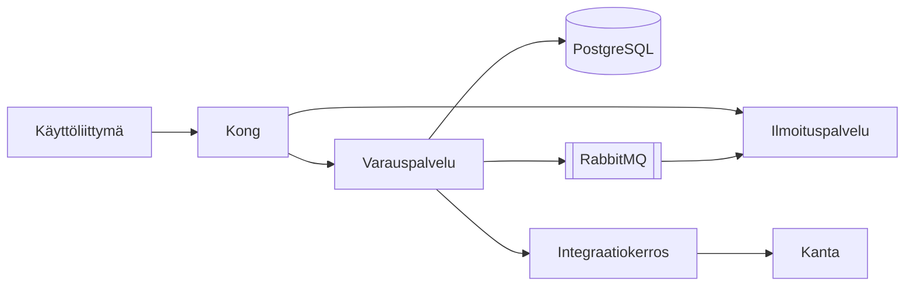

# Arkkitehtuurikuvaus: ajanvarausalusta

## Yleiskuva

Ajanvarausalusta koostuu neljästä palvelusta: käyttöliittymästä, varauspalvelusta, ilmoituspalvelusta ja integraatiokerroksesta. Palvelut ajetaan ⟪product|Kubernetes⟫-klusterissa ja ne keskustelevat keskenään ⟪acronym|gRPC⟫:llä. Ulospäin tarjotaan ⟪acronym|REST⟫-rajapinta ⟪product|Kong⟫-⟦typo|yhdyskäytvän|yhdyskäytävän⟧ kautta.

Kaavio on tehty ⟪product|Mermaidilla⟫ ja se päivitetään ⟦punctuation|aina kun|aina, kun⟧ rakenne muuttuu.

## Komponentit

### Käyttöliittymä

⟪product|React⟫-sovellus, joka ⟦typo|tarjoillan|tarjoillaan⟧ ⟪product|nginx⟫istä. Käyttöliittymä ei sisällä ⟦typo|liiketoimintalogiikaka|liiketoimintalogiikkaa⟧ ⟦confusion*|vain|vaan⟧ kutsuu rajapintaa. Tilanhallinta on toteutettu ⟪product|TanStack Queryllä⟫.

### Varauspalvelu

⟪product|Go⟫-kielinen palvelu, joka omistaa varausten tietomallin. Se varmistaa, ettei samaa aikaa voi varata kahdesti, käyttämällä tietokannan yksilöllisyysrajoitetta ja ⟦inflection|optimististä|optimistista⟧ lukitusta. Jokainen kirjoitus tuottaa tapahtuman jonoon.

Palvelu skaalataan vaakasuunnassa; tilaa ei pidetä muistissa. Tyypillinen vasteaika on ⟪unit|alle 50 ms⟫ ja kuorma ⟪unit|200 pyyntöä sekunnissa⟫ ruuhka-aikaan.

### Ilmoituspalvelu

Kuuntelee ⟪product|RabbitMQ⟫-jonoa ja lähettää tekstiviestit, sähköpostit ja ⟪product|OmaKanta⟫-viestit. Toimitus yritetään uudelleen ⟪unit|kolme kertaa⟫ ⟦inflection|kasvavallä|kasvavalla⟧ viiveellä, minkä jälkeen viesti siirretään ⟪product|dead letter⟫ -jonoon.

### Integraatiokerros

Muuntaa sisäiset tapahtumat ⟪acronym|HL7 FHIR⟫ -muotoon ja välittää ne ⟪name|Kanta⟫-palveluihin. Kerros on ainoa komponentti, joka käsittelee henkilötunnuksia selväkielisenä, ja se ajetaan omassa ⟪identifier|`namespace`⟫ssaan tiukemmilla ⟦compound_split|verkko säännöillä|verkkosäännöillä⟧.

## Laadulliset vaatimukset

| Vaatimus | Tavoite | Toteutus |
|----------|---------|----------|
| Saatavuus | ⟪unit|99,9 %⟫ | Kolme saatavuusvyöhykettä, automaattinen vikasiirto |
| Palautumisaika | ⟪unit|15 min⟫ | ⟪product|Patroni⟫ + jatkuva ⟦typo|varmuuskoipointi|varmuuskopiointi⟧ |
| Tietoturva | ⟪acronym|ISO 27001⟫ | Salaus levossa ja siirrossa, ⟪compound|käyttöoikeushallinta⟫ roolipohjaisesti |
| Saavutettavuus | ⟪acronym|WCAG⟫ 2.1 AA | Auditoitu toukokuussa 2026 |

## Tietovirrat ja tietosuoja

Henkilötiedot pseudonymisoidaan ennen tallennusta analytiikkakantaan. Tunnisteavain säilytetään erillisessä avainholvissa (⟪product|HashiCorp Vault⟫). Analytiikkaan ⟦inflection|siirretän|siirretään⟧ vain ⟪compound|hoidonsaatavuustilastoihin⟫ tarvittavat kentät.

Lokit eivät saa sisältää henkilötunnuksia. Tämä varmistetaan lokikirjaston suodattimella, jonka testit ajetaan jokaisessa ⟦loan|buildissa|käännöksessä⟧.

## Tunnetut rajoitteet

- Integraatiokerros on yksittäinen vikapiste ⟪name|Kanta⟫-suuntaan; kahdennus on suunnitteilla vuodelle 2027.
- Ilmoituspalvelun ⟦compound_split|tekstiviesti operaattori|tekstiviestioperaattori⟧ on vain yksi, minkä vuoksi operaattorin häiriö pysäyttää muistutukset.
- Vain ⟦capitalization|Suomalainen|suomalainen⟧ henkilötunnusmuoto on tuettu; ruotsalaisia tunnuksia ei vielä tueta.
