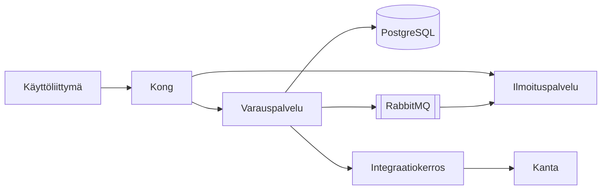

# Arkkitehtuurikuvaus: ajanvarausalusta

## Yleiskuva

Ajanvarausalusta koostuu neljästä palvelusta: käyttöliittymästä, varauspalvelusta, ilmoituspalvelusta ja integraatiokerroksesta. Palvelut ajetaan Kubernetes-klusterissa ja ne keskustelevat keskenään gRPC:llä. Ulospäin tarjotaan REST-rajapinta Kong-yhdyskäytvän kautta.

Kaavio on tehty Mermaidilla ja se päivitetään aina kun rakenne muuttuu.

## Komponentit

### Käyttöliittymä

React-sovellus, joka tarjoillan nginxistä. Käyttöliittymä ei sisällä liiketoimintalogiikaka vain kutsuu rajapintaa. Tilanhallinta on toteutettu TanStack Queryllä.

### Varauspalvelu

Go-kielinen palvelu, joka omistaa varausten tietomallin. Se varmistaa, ettei samaa aikaa voi varata kahdesti, käyttämällä tietokannan yksilöllisyysrajoitetta ja optimististä lukitusta. Jokainen kirjoitus tuottaa tapahtuman jonoon.

Palvelu skaalataan vaakasuunnassa; tilaa ei pidetä muistissa. Tyypillinen vasteaika on alle 50 ms ja kuorma 200 pyyntöä sekunnissa ruuhka-aikaan.

### Ilmoituspalvelu

Kuuntelee RabbitMQ-jonoa ja lähettää tekstiviestit, sähköpostit ja OmaKanta-viestit. Toimitus yritetään uudelleen kolme kertaa kasvavallä viiveellä, minkä jälkeen viesti siirretään dead letter -jonoon.

### Integraatiokerros

Muuntaa sisäiset tapahtumat HL7 FHIR -muotoon ja välittää ne Kanta-palveluihin. Kerros on ainoa komponentti, joka käsittelee henkilötunnuksia selväkielisenä, ja se ajetaan omassa `namespace`ssaan tiukemmilla verkko säännöillä.

## Laadulliset vaatimukset

| Vaatimus | Tavoite | Toteutus |
|----------|---------|----------|
| Saatavuus | 99,9 % | Kolme saatavuusvyöhykettä, automaattinen vikasiirto |
| Palautumisaika | 15 min | Patroni + jatkuva varmuuskoipointi |
| Tietoturva | ISO 27001 | Salaus levossa ja siirrossa, käyttöoikeushallinta roolipohjaisesti |
| Saavutettavuus | WCAG 2.1 AA | Auditoitu toukokuussa 2026 |

## Tietovirrat ja tietosuoja

Henkilötiedot pseudonymisoidaan ennen tallennusta analytiikkakantaan. Tunnisteavain säilytetään erillisessä avainholvissa (HashiCorp Vault). Analytiikkaan siirretän vain hoidonsaatavuustilastoihin tarvittavat kentät.

Lokit eivät saa sisältää henkilötunnuksia. Tämä varmistetaan lokikirjaston suodattimella, jonka testit ajetaan jokaisessa buildissa.

## Tunnetut rajoitteet

- Integraatiokerros on yksittäinen vikapiste Kanta-suuntaan; kahdennus on suunnitteilla vuodelle 2027.
- Ilmoituspalvelun tekstiviesti operaattori on vain yksi, minkä vuoksi operaattorin häiriö pysäyttää muistutukset.
- Vain Suomalainen henkilötunnusmuoto on tuettu; ruotsalaisia tunnuksia ei vielä tueta.
