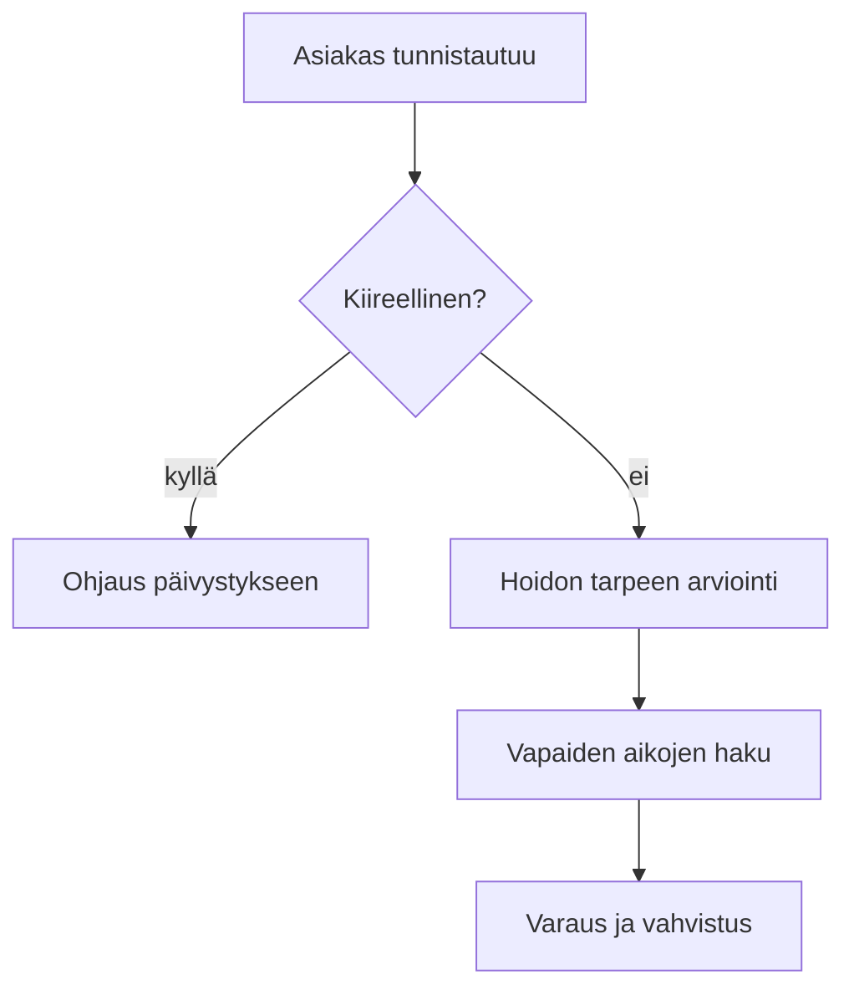

# Prosessikuvaus: kiireettömän ajan varaaminen

Omistaja: Aila Meriluoto, palvelupäällikkö
Versio: 1.4
Hyväksytty: Toukokuussa 2026

## Tarkoitus

Prosessi kuvaa, miten asiakas varaa kiireettömän vastaanottoajan ja miten hoidon tarpeen arviointi liittyy varaukseen. Kuvaus koskee kaikkia perusterveydenhuollon toimipisteitä.

## Roolit

| Rooli | Vastuu |
|-------|--------|
| Asiakas | Tekee varauksen verkossa, sovelluksessa tai puhelmitse |
| Hoidon tarpeen arvioija | Sairaanhoitaja, joka arvioi kiireellisyyden |
| Ajanvarausjärjestelmä | Tarjoaa vapaat ajat ja lähettää vahvistukset |
| Palvelupäällikkö | Omistaa prosessin ja hyväksyy muutokset |

## Vaiheet

### 1. Tunnistautuminen

Asiakas tunnistautuu Suomi.fi-tunnistuksella. Puhelimitse asioitaessa hoitaja varmistta henkilöllisyyden kysymällä henkilötunnuksen ja koti osoitteen.

### 2. Hoidon tarpeen arviointi

Hoitaja arvioi hoidon tarpeen 10 minuutin kuluessa yhteydenotosta. Arviointi kirjataan potilastietojärjestelmään rakenteisena. Jos asiakas tarvitsee hoitoa 24 tunnin sisällä, hänet ohjataan päivystyksen.

Verkossa asiakas vastaa esitietokyselyyn, jonka perusteella järjestelmä ehdottaa joko vastaanottoaikaa tai hoitajan soittoa. Kysely perustuu Käypä hoito -suosituksiin.

### 3. Ajan valinta

Järjestelmä näyttää vapaat ajat kuuden viikon jaksolta. Ajat näytetään ensisijaisesti asiakkaan omasta terveys asemasta. Asiakas voi valita myös toisen toimipisteen.

Hoitotakuu edellyttää, että kiireettömään hoitoon pääsee 14 vuorokauden kuluessa. Jos aikaa ei ole tarjolla asiakas siirretään jonoon ja hänelle ilmoitetaan heti, kun aika vapautuu.

### 4. Vahvistus ja muistutus

Vahvistus lähetetään OmaKantaan ja tekstiviestillä. Muistutus lähtee 48 tuntia ennen aikaa, jos asiakas on antanut siihen luvan. Suostumus kysytään ensimmäisellä varauskerralla.

## Mittarit

- Hoidon tarpeen arviointien osuus, jotka valmistuvat 10 minuutissa: tavoite 95 %.
- Peruuttamatta jääneiden aikojen osuus: tavoite alle 4 %. tammikuussa 2026 osuus oli 6,2 %.
- Asiakastyytyväisyys NPS-mittarilla: tavoite yli 40.

Mittarit raportoidaan johtoryhmälle kuukausittain. Poikkeamat käsitellaan laatupalaverissa.

## Poikkeustilanteet

Kun ajanvarausjärjestelmä on poissa käytöstä, varaukset otetaan vastaan puhelimitse ja kirjataan manualisesti Excel-lomakkeelle `\\palvelin\varaukset\varakirja.xlsx`. Tiedot siirretään järjestelmään vuorokauden kuluessa katkon päättymisestä. Katkosta tiedotetaan intranetissä ja Kelan yhteyshenkilölle.
