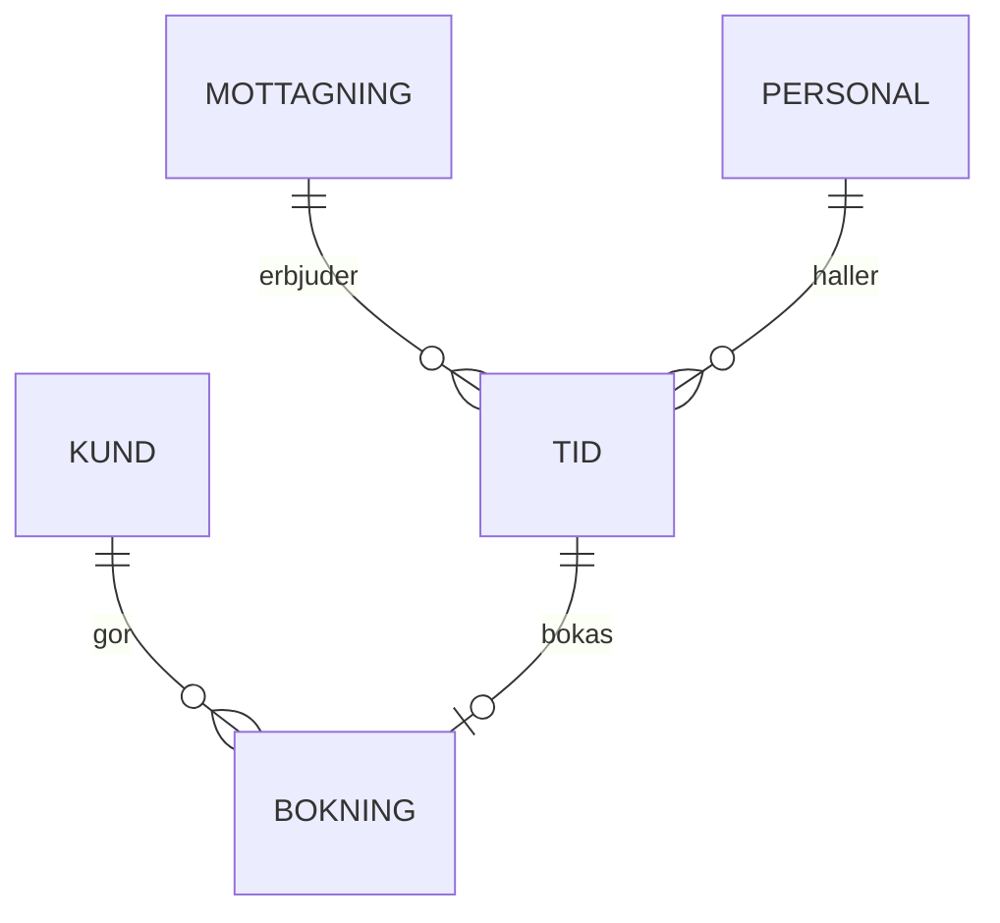

# Datamodell: bokningar och kunder

Det här dokumentet beskriver tidsbokningsplattformens centrala informations objekt och relationerna mellan dem. Modellen är implementerad i PostgreSQL och migreringarna hanteras med Flyway.

## Översikt



Varje bokning refererar till exakt en tid och en kund. En tid kan vara obokad, då är `bokning_id` `NULL`.

## Tabeller

### kund

| Kolumn | Typ | Beskrivning |
|--------|-----|-------------|
| `id` | uuid | Intern identifierare |
| `pnr_hash` | bytea | SHA-256-hash av personnumret med salt värde |
| `sprak` | text | sv, fi eller en |
| `skapad` | timestamptz | Tidpunkt för skapande |

Personnumret lagras inte i klartext. Kundens kontaktuppgifter hämtas vid behov från Skatteverket och kopieras inte till den här tabellen. Dom som behöver uppgifterna slå upp dem via folkbokföringstjänsten.

### tid

Tabellen innehåller dem mottagningstider som erbjuds. `borjar` och `slutar` är av typen timestamptz. Överlappande tider för samma personal förhindas med en `EXCLUDE USING gist`-restriktion:

```sql
ALTER TABLE tid ADD CONSTRAINT tid_ej_overlapp
  EXCLUDE USING gist (personal_id WITH =, tstzrange(borjar, slutar) WITH &&);
```

Tidens längd i minuter beräknas i frågan och lagrades inte separat.

### bokning

Bokningens status är ett av värdena `bekraftad`, `avbokad` eller `flyttad`. Statushistoriken skrivs till tabellen `bokning_handelse`. Avbokade bokningar sparas i 10 år enligt bokföringslagen.

Främmande nycklar är `ON DELETE RESTRICT`: en kund kan inte raderas om hen har bokningar. Radering görs genom att pseudonymsera kundens uppgifter.

## Index och prestanda

Den vanligaste frågan hämtar lediga tider per mottagning och dag. För den finns ett partiellt index `WHERE bokning_id IS NULL`. Frågan tar under 5 ms i en tabell med två miljoner rader.

Rapportfrågor körs mot läs repliken, aldrig mot huvuddatabasen. Replikeringsfördröjningen är normalt under en sekund.

## Ändringar i modellen

Ändringar görs som Flyway-migreringar i katalogen `db/migrations`. Varje migrering granskas på GitHub och testas mot en kopia av staging-databasen. Kolumner tas inte bort i samma release som deras användning upphör, utan först i nästa.

Datamodellen ägs av Aino Kallas. Frågor ställs i #datamodell. Column and table names are in Swedish without diacritics because the ORM cannot quote them reliably. Namnen är alltså inte på Svenska i strikt mening, vilkte ibland förvirrar nya teamsmedlemmarna.
