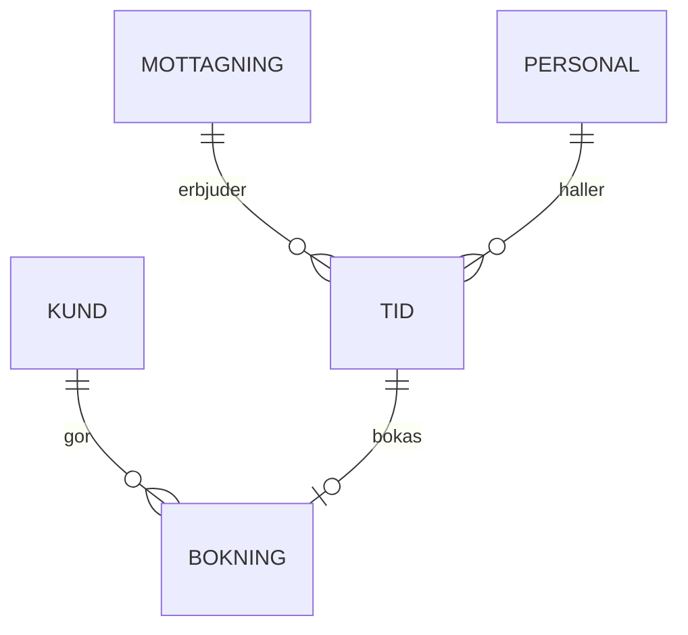

# Datamodell: bokningar och kunder

Det här dokumentet beskriver ⟪compound|tidsbokningsplattformens⟫ centrala ⟦sarskrivning|informations objekt|informationsobjekt⟧ och relationerna mellan dem. Modellen är implementerad i ⟪product|PostgreSQL⟫ och migreringarna hanteras med ⟪product|Flyway⟫.

## Översikt



Varje bokning refererar till exakt en tid och en kund. En tid kan vara obokad, då är ⟪identifier|`bokning_id`⟫ ⟪code|`NULL`⟫.

## Tabeller

### kund

| Kolumn | Typ | Beskrivning |
|--------|-----|-------------|
| ⟪identifier|`id`⟫ | ⟪code|uuid⟫ | Intern identifierare |
| ⟪identifier|`pnr_hash`⟫ | ⟪code|bytea⟫ | ⟪acronym|SHA-256⟫-hash av personnumret med ⟦sarskrivning|salt värde|saltvärde⟧ |
| ⟪identifier|`sprak`⟫ | ⟪code|text⟫ | ⟪code|sv⟫, ⟪code|fi⟫ eller ⟪code|en⟫ |
| ⟪identifier|`skapad`⟫ | ⟪code|timestamptz⟫ | Tidpunkt för skapande |

Personnumret lagras inte i klartext. Kundens ⟪compound|kontaktuppgifter⟫ hämtas vid behov från ⟪name|Skatteverket⟫ och kopieras inte till den här tabellen. ⟦de_dem_gender*|Dom|De⟧ som behöver uppgifterna ⟦verb_form*|slå|slår⟧ upp dem via ⟪compound|folkbokföringstjänsten⟫.

### tid

Tabellen innehåller ⟦de_dem_gender*|dem|de⟧ mottagningstider som erbjuds. ⟪identifier|`borjar`⟫ och ⟪identifier|`slutar`⟫ är av typen ⟪code|timestamptz⟫. Överlappande tider för samma personal ⟦typo|förhindas|förhindras⟧ med en ⟪code|`EXCLUDE USING gist`⟫-restriktion:

```sql
ALTER TABLE tid ADD CONSTRAINT tid_ej_overlapp
  EXCLUDE USING gist (personal_id WITH =, tstzrange(borjar, slutar) WITH &&);
```

Tidens längd i minuter beräknas i frågan och ⟦verb_form*|lagrades|lagras⟧ inte separat.

### bokning

Bokningens status är ett av värdena ⟪code|`bekraftad`⟫, ⟪code|`avbokad`⟫ eller ⟪code|`flyttad`⟫. ⟪compound|Statushistoriken⟫ skrivs till tabellen ⟪identifier|`bokning_handelse`⟫. Avbokade bokningar sparas i ⟪unit|10 år⟫ enligt ⟪compound|bokföringslagen⟫.

⟪phrase|Främmande nycklar⟫ är ⟪code|`ON DELETE RESTRICT`⟫: en kund kan inte raderas om hen har bokningar. Radering görs genom att ⟦typo|pseudonymsera|pseudonymisera⟧ kundens uppgifter.

## Index och prestanda

Den vanligaste frågan hämtar lediga tider per mottagning och dag. För den finns ett partiellt index ⟪code|`WHERE bokning_id IS NULL`⟫. Frågan tar ⟪unit|under 5 ms⟫ i en tabell med ⟪unit|två miljoner⟫ rader.

Rapportfrågor körs mot ⟦sarskrivning|läs repliken|läsrepliken⟧, aldrig mot ⟪compound|huvuddatabasen⟫. ⟪compound|Replikeringsfördröjningen⟫ är ⟪phrase|normalt under⟫ en sekund.

## Ändringar i modellen

Ändringar görs som ⟪product|Flyway⟫-migreringar i katalogen ⟪code|`db/migrations`⟫. Varje migrering granskas på ⟪product|GitHub⟫ och testas mot en kopia av ⟪code|staging⟫-databasen. Kolumner tas inte bort i samma release som deras användning upphör, utan först i nästa.

Datamodellen ägs av ⟪name|Aino Kallas⟫. Frågor ställs i ⟪identifier|#datamodell⟫. ⟪foreign|Column and table names are in Swedish without diacritics because the ORM cannot quote them reliably.⟫ Namnen är alltså inte på ⟦capitalization|Svenska|svenska⟧ i strikt mening, ⟦typo|vilkte|vilket⟧ ibland förvirrar nya ⟦compound_link|teamsmedlemmarna|teammedlemmarna⟧.
