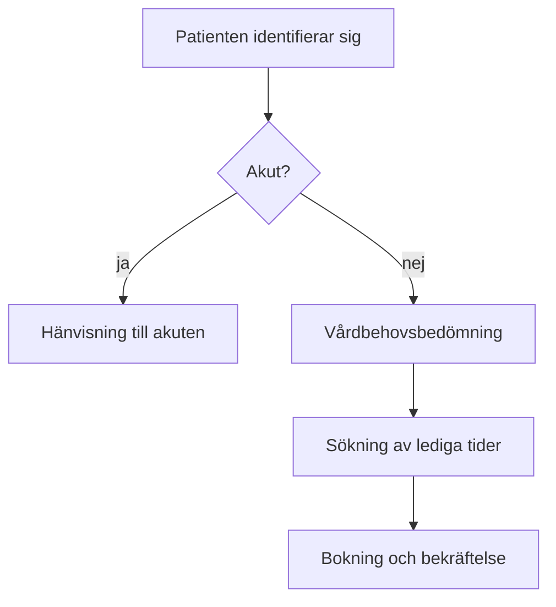

# Processbeskrivning: bokning av icke-akut besök

Processägare: ⟪name|Elin Wägner⟫, verksamhetschef
Version: 1.4
Godkänd: maj 2026

## Syfte

Processen beskriver hur en patient bokar ett icke-akut besök och hur vårdbehovsbedömningen hänger ihop med bokningen. Beskrivningen gäller alla ⟪compound|primärvårdsmottagningar⟫ i regionen.

## Roller

| Roll | Ansvar |
|------|--------|
| Patient | Bokar via webben, appen eller telefon |
| Bedömande sjuksköterska | ⟦verb_form|Bedömmer|Bedömer⟧ brådskandegraden |
| ⟦sarskrivning|Boknings systemet|Bokningssystemet⟧ | Visar lediga tider och skickar bekräftelser |
| Verksamhetschef | Äger processen och godkänner ändringar |

## Steg

### 1. Identifiering

Patienten identifierar sig med ⟪name|BankID⟫. Vid telefonkontakt verifierar sjuksköterskan identiteten genom att fråga efter personnummer och folkbokföringsadress.

### 2. Vårdbehovsbedömning

Sjuksköterskan bedömer vårdbehovet inom ⟪unit|10 minuter⟫ från kontakten. Bedömningen dokumenteras strukturerat i journalsystemet. Om patienten behöver vård inom ⟪unit|24 timmar⟫ hänvisas han eller hon till akuten.

På webben besvarar patienten ⟦de_dem_gender*|en|ett⟧ frågeformulär, utifrån vilket systemet föreslår antingen en ⟦compound_link|besöktid|besökstid⟧ eller att en sjuksköterska ringer upp. Formuläret bygger på ⟪name|Socialstyrelsens⟫ riktlinjer.

### 3. Val av tid

Systemet visar lediga tider ⟪unit|sex veckor⟫ framåt. Tiderna visas i första hand på patientens egen ⟦sarskrivning|vård central|vårdcentral⟧. Patienten kan också ⟦typo|vläja|välja⟧ en annan ⟦double_consonant|motagning|mottagning⟧.

Vårdgarantin innebär att patienten ska få ett besök inom ⟪unit|3 dagar⟫ för medicinsk bedömning. Om ingen tid finns sätts patienten upp på väntelista och ⟦verb_form*|meddelats|meddelas⟧ så snart en tid blir ledig.

### 4. Bekräftelse och påminnelse

Bekräftelsen skickas till ⟪name|1177⟫ och per ⟪acronym|SMS⟫. Påminnelsen går ut ⟪unit|48 timmar⟫ före besöket om patienten har gett sitt ⟦typo|samtyck|samtycke⟧. Samtycket efterfrågas vid första bokningen.

## Mätetal

- Andel vårdbehovsbedömningar som blir klara inom ⟪unit|10 minuter⟫: mål ⟪unit|95 %⟫.
- Andel uteblivna besök: mål under ⟪unit|4 %⟫. I januari 2026 var andelen ⟪unit|6,2 %⟫.
- Patientnöjdhet enligt ⟪acronym|NPS⟫: mål över 40.

Mätetalen rapporteras till ledningsgruppen varje månad. Avvikelser behandlas på kvalitetsmötet.

## Avvikelser

När bokningssystemet ligger nere tas bokningar emot per telefon och antecknas manuellt i ⟪product|Excel⟫-blanketten ⟪code|`\\server\bokningar\reserv.xlsx`⟫. Uppgifterna förs in i systemet inom ⟪unit|ett dygn⟫ efter att avbrottet är över. Avbrottet meddelas på intranätet och till ⟦de_dem_gender*|dom|de⟧ berörda mottagningarna.
