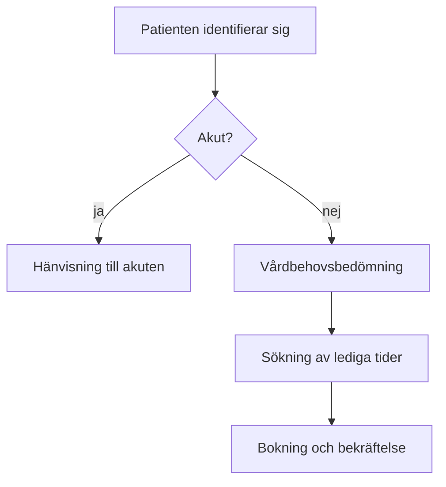

# Processbeskrivning: bokning av icke-akut besök

Processägare: Elin Wägner, verksamhetschef
Version: 1.4
Godkänd: maj 2026

## Syfte

Processen beskriver hur en patient bokar ett icke-akut besök och hur vårdbehovsbedömningen hänger ihop med bokningen. Beskrivningen gäller alla primärvårdsmottagningar i regionen.

## Roller

| Roll | Ansvar |
|------|--------|
| Patient | Bokar via webben, appen eller telefon |
| Bedömande sjuksköterska | Bedömmer brådskandegraden |
| Boknings systemet | Visar lediga tider och skickar bekräftelser |
| Verksamhetschef | Äger processen och godkänner ändringar |

## Steg

### 1. Identifiering

Patienten identifierar sig med BankID. Vid telefonkontakt verifierar sjuksköterskan identiteten genom att fråga efter personnummer och folkbokföringsadress.

### 2. Vårdbehovsbedömning

Sjuksköterskan bedömer vårdbehovet inom 10 minuter från kontakten. Bedömningen dokumenteras strukturerat i journalsystemet. Om patienten behöver vård inom 24 timmar hänvisas han eller hon till akuten.

På webben besvarar patienten en frågeformulär, utifrån vilket systemet föreslår antingen en besöktid eller att en sjuksköterska ringer upp. Formuläret bygger på Socialstyrelsens riktlinjer.

### 3. Val av tid

Systemet visar lediga tider sex veckor framåt. Tiderna visas i första hand på patientens egen vård central. Patienten kan också vläja en annan motagning.

Vårdgarantin innebär att patienten ska få ett besök inom 3 dagar för medicinsk bedömning. Om ingen tid finns sätts patienten upp på väntelista och meddelats så snart en tid blir ledig.

### 4. Bekräftelse och påminnelse

Bekräftelsen skickas till 1177 och per SMS. Påminnelsen går ut 48 timmar före besöket om patienten har gett sitt samtyck. Samtycket efterfrågas vid första bokningen.

## Mätetal

- Andel vårdbehovsbedömningar som blir klara inom 10 minuter: mål 95 %.
- Andel uteblivna besök: mål under 4 %. I januari 2026 var andelen 6,2 %.
- Patientnöjdhet enligt NPS: mål över 40.

Mätetalen rapporteras till ledningsgruppen varje månad. Avvikelser behandlas på kvalitetsmötet.

## Avvikelser

När bokningssystemet ligger nere tas bokningar emot per telefon och antecknas manuellt i Excel-blanketten `\\server\bokningar\reserv.xlsx`. Uppgifterna förs in i systemet inom ett dygn efter att avbrottet är över. Avbrottet meddelas på intranätet och till dom berörda mottagningarna.
